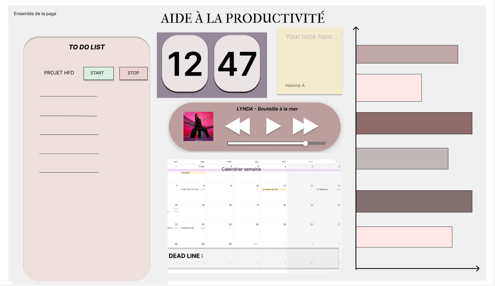

# Dashboard d'aide à la productivité

Hassna AGOUZZAL et Ghofrane BOUZEKRI ont réalisé pendant un mois un dashboard qui est un outil d'aide à la productivité. 

Voici l'accès à notre Trello

 <a href="https://trello.com/b/opYAwHVE/t%C3%A2ches">Trello</a>

## Description du Dashboard

Notre dashboard contient six widgets:

Un widget TodoList sur lequel l'utilisateur peut ajouter, modifier et supprimer des tâches à accomplir.

Un widget Horloge qui indique l'heure actuelle pour que l'utilisateur ait une notion du temps lors du travail et puisse respecter les heures de productivité indiquer dans le graphique.

Un widget Note pour que l'utilisateur puisse écrire tous ce qu'il veut sans pour autant se soucier d'avoir une feuille ou pas.

Un widget Youtube afin d'accéder à de la musique pour se détendre ou encore un tutoriel.

Un widget Calendrier pour que l'utilisateur puisse s'organiser au fil du temps.

Un widget Graphique pour que l'utilisateur soit conscient qu'il y a des pics de concentration au cours de sa journée et qu'il en prenne compte lors de son travail.

## Maquette

Nous avons réalisé une maquette sur Figma:

