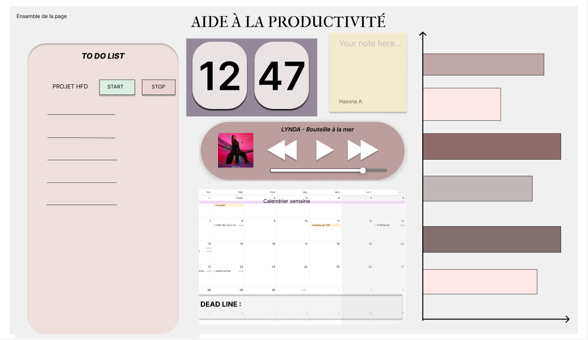
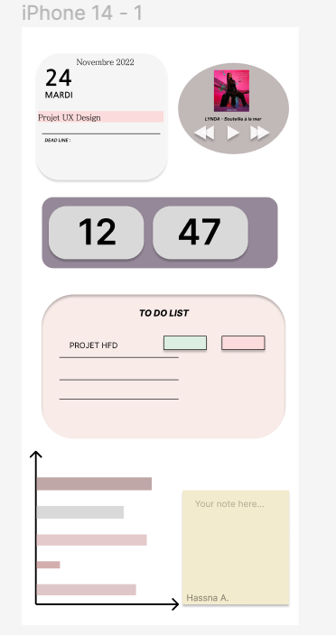

# Dashboard d'aide à la productivité

Hassna AGOUZZAL et Ghofrane BOUZEKRI ont réalisé pendant un mois un dashboard qui est un outil d'aide à la productivité. 

Voici l'accès à notre Trello

 <a href="https://trello.com/b/opYAwHVE/t%C3%A2ches">Trello Hassna et Ghofrane</a>

## Description du Dashboard

Notre dashboard contient six widgets:

Un widget TodoList sur lequel l'utilisateur peut ajouter, modifier et supprimer des tâches à accomplir.

Un widget Horloge qui indique l'heure actuelle locale pour que l'utilisateur ait une notion du temps lors du travail et puisse prendre connaissance et respecter les heures de productivité indiquer sur le graphique (cf widget graphique).

Un widget Note qui va permettre à l’utilisateur de prendre rapidement des notes sans devoir trouver un stylo ou ouvrir une autre page et avoir une vue constante dessus.

Un widget Youtube afin d'accéder à de la musique pour se détendre ou encore un tutoriel sans sortir du dashboard.

Un widget Calendrier pour que l'utilisateur puisse s'organiser au fil du temps et puisse programmer des événements.

Un widget Graphique pour que l'utilisateur prenne conscience des pics de concentration au cours de la journée et qu'il en prenne compte lors de son travail.

## Maquette

Nous avons réalisé une maquette sur Figma:

Voici la maquette sur ordinateur portable (MacBook Air M2)

Voici la maquette sur téléphone (iPhone 14)

